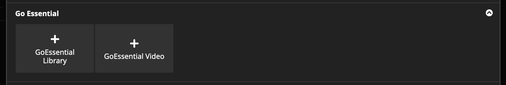
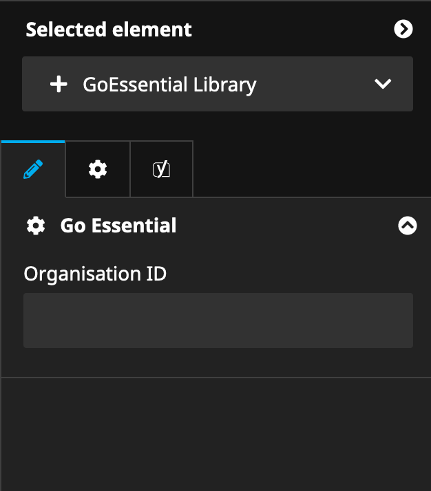
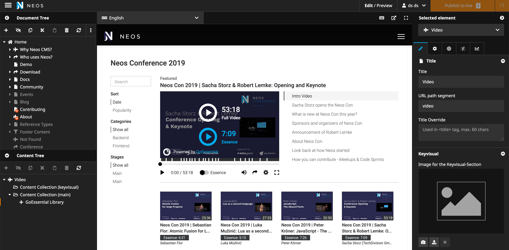
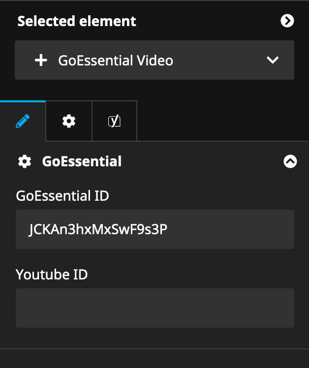
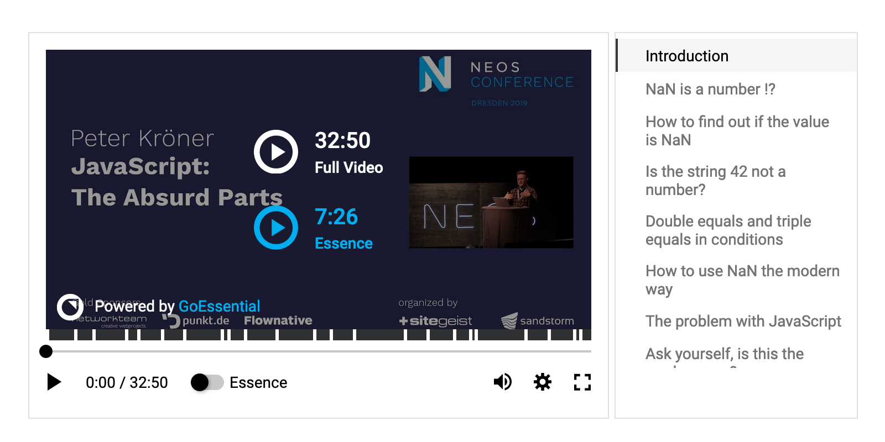

# GoEssential integration for Neos CMS

With GoEssential you can bring all your videos to your website and excite your visitors with
essentialized videos.

## Installation

Add the dependency to your site package like this

    composer require goe/neos-package --no-update 
    
And then run `composer update` in your projects root folder.

## Usage

The package introduces two new content elements called `GoE.Neos:Content.Library` and ``GoE.Neos:Content.Video``:

 

### GoE.Neos:Content.Library
Once you have created a new content element you have to set your GoEssential organisation identifier in the inspector panel:
 

Your GoEssential video library is now ready for publishing:

### GoE.Neos:Content.Library
If you would like to embed a single video you can do that as well. You can either set a GoEssential or a Youtube video ID.

Your GoEssential video embed is now ready for publishing:

## Acknowledgment
https://goessential.com/

## License
The MIT License (MIT). Please see [LICENSE](LICENSE) for more information.

